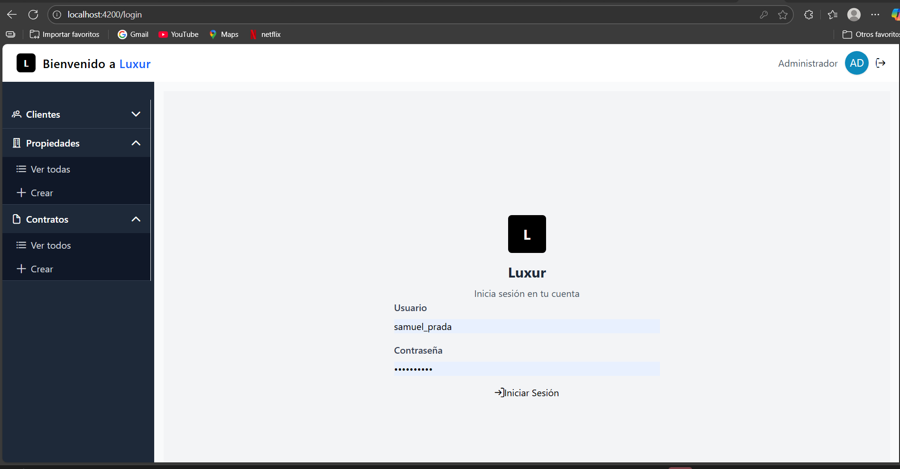
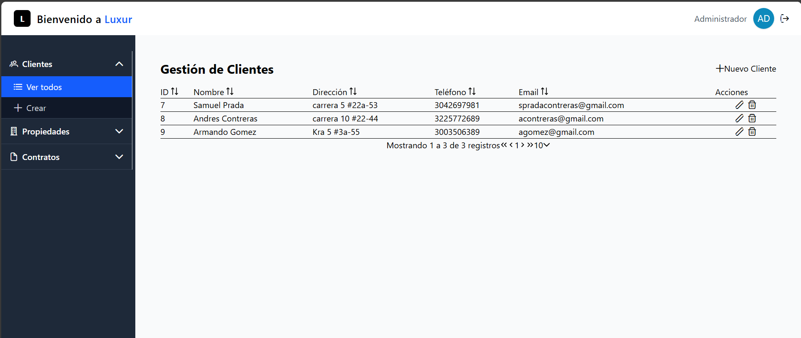
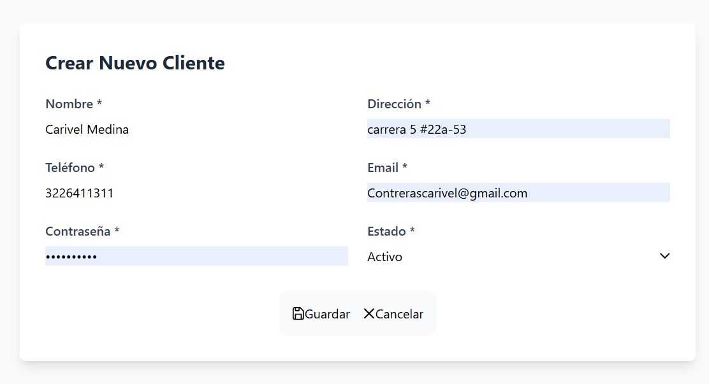
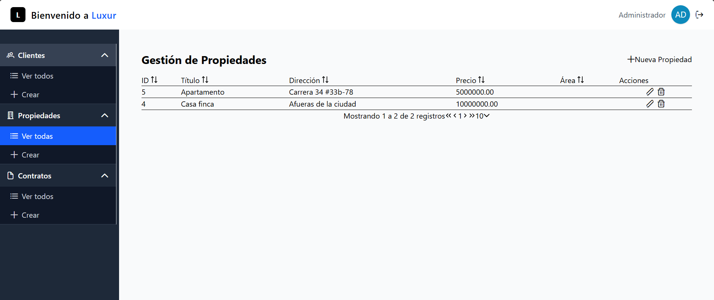
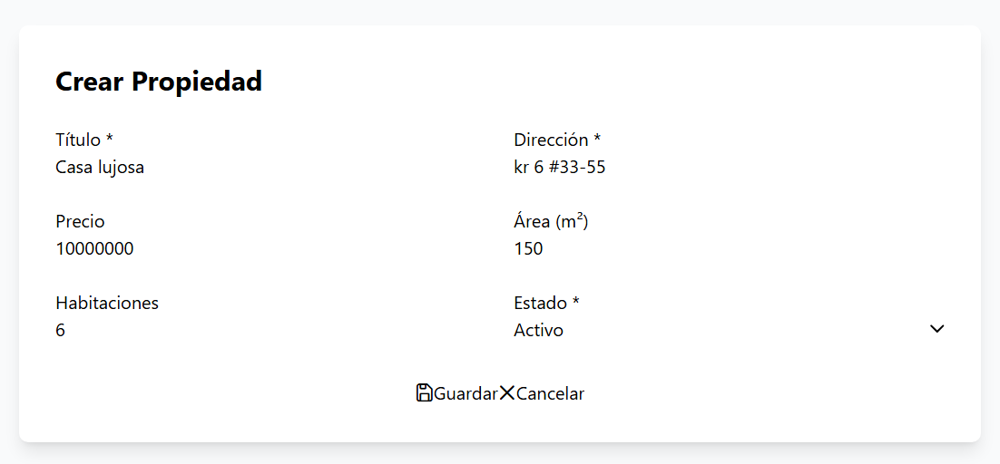
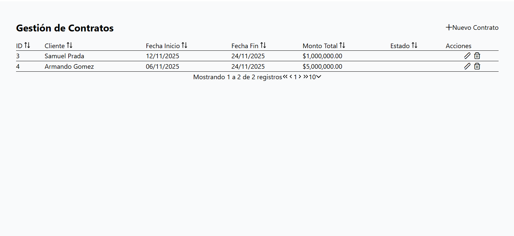
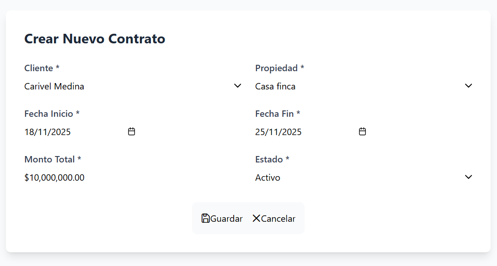

# 🏢 Sistema de Gestión Luxur


> Plataforma integral para la administración de clientes, contratos y propiedades con interfaz moderna y segura.

---

## 📑 Tabla de Contenidos

- [Descripción](#-descripción)
- [Características](#-características-principales)
- [Tecnologías](#-tecnologías)
- [Requisitos Previos](#-requisitos-previos)
- [Instalación](#️-instalación)
- [Configuración](#️-configuración)
- [Uso](#-uso)
- [Estructura del Proyecto](#-estructura-del-proyecto)
- [Capturas de Pantalla](#-capturas-de-pantalla)
- [Roles y Permisos](#-roles-y-permisos)
- [API REST](#-api-rest)
- [Validaciones](#-validaciones-y-reglas-de-negocio)
- [Preguntas Frecuentes](#-preguntas-frecuentes)
- [Roadmap](#-roadmap)
- [Contribuir](#-contribuir)
- [Soporte](#-soporte)
- [Licencia](#-licencia)
- [Autor](#-autor)


## 📖 Descripción

**Sistema de Gestión Luxur** es una aplicación web completa diseñada para centralizar y optimizar la gestión de registros empresariales. Permite administrar clientes, propiedades y contratos mediante una interfaz intuitiva construida con Angular y PrimeNG, respaldada por un robusto backend en Django.

### Objetivo

Proporcionar una herramienta administrativa robusta, organizada y fácil de usar que permita:
- Centralizar información crítica del negocio
- Automatizar procesos de registro y seguimiento
- Garantizar seguridad mediante autenticación y control de roles
- Optimizar la toma de decisiones con datos organizados

---

## ✨ Características Principales

- 🔐 **Autenticación segura** con control de sesiones
- 👥 **Gestión completa de clientes** (crear, listar, editar, eliminar)
- 🏠 **Administración de propiedades** con información detallada
- 📄 **Control integral de contratos** vinculados a clientes y propiedades
- 🎨 **Interfaz moderna y responsive** con PrimeNG
- 🔄 **Operaciones CRUD completas** en todos los módulos
- ⚡ **API REST robusta** con Django REST Framework
- ✅ **Validaciones en tiempo real** en formularios
- 🔔 **Sistema de notificaciones** para operaciones exitosas/fallidas
- 🛡️ **Control de acceso basado en roles** (Administrador/Usuario)
- 📱 **Diseño responsive** compatible con dispositivos móviles
- 🗂️ **Organización jerárquica** de información

---

## 🧰 Tecnologías

### Frontend
- **Angular** 17+
- **TypeScript** 5.x
- **PrimeNG** (componentes UI)
- **HTML5** / **CSS3**
- **RxJS** (programación reactiva)

### Backend
- **Python** 3.10+
- **Django** 4.x
- **Django REST Framework** 3.x
- **MySQL** / **PostgreSQL** / **SQLite**

### Herramientas de Desarrollo
- **Node.js** 18+
- **npm** / **yarn**
- **Git** (control de versiones)
- **Postman** (testing API)

---

## 📋 Requisitos Previos

Asegúrate de tener instalado:

- **Node.js** 18 o superior → [Descargar](https://nodejs.org/)
- **Python** 3.10 o superior → [Descargar](https://www.python.org/)
- **Git** → [Descargar](https://git-scm.com/)
- **MySQL** / **PostgreSQL** (opcional, SQLite incluido)
- Navegador moderno (Chrome, Firefox, Edge)

---

## 🛠️ Instalación

### 1. Clonar el Repositorio

```bash
git clone https://github.com/tu-usuario/sistema-luxur.git
cd sistema-luxur
```

### 2. Configurar el Backend (Django)

```bash
# Navegar a la carpeta backend
cd backend

# Crear entorno virtual
python -m venv venv

# Activar entorno virtual
# En Windows:
venv\Scripts\activate
# En macOS/Linux:
source venv/bin/activate

# Instalar dependencias
pip install -r requirements.txt

# Aplicar migraciones
python manage.py migrate

# Crear superusuario (administrador)
python manage.py createsuperuser

# Cargar datos de prueba (opcional)
python manage.py loaddata fixtures/initial_data.json

# Ejecutar servidor
python manage.py runserver
```

El backend estará disponible en: `http://localhost:8000`

### 3. Configurar el Frontend (Angular)

```bash
# Abrir nueva terminal y navegar al frontend
cd frontend

# Instalar dependencias
npm install

# Ejecutar servidor de desarrollo
ng serve --open
```

El frontend se abrirá automáticamente en: `http://localhost:4200`

---

## ⚙️ Configuración

### Variables de Entorno (Backend)

Crea un archivo `.env` en la carpeta `backend/`:

```env
# Django
DEBUG=True
SECRET_KEY=tu-clave-secreta-super-segura
ALLOWED_HOSTS=localhost,127.0.0.1

# Base de datos
DATABASE_ENGINE=django.db.backends.mysql
DATABASE_NAME=luxur_db
DATABASE_USER=root
DATABASE_PASSWORD=tu_password
DATABASE_HOST=localhost
DATABASE_PORT=3306

# CORS
CORS_ALLOWED_ORIGINS=http://localhost:4200
```

### Configuración de la Base de Datos

#### Opción 1: MySQL

```sql
CREATE DATABASE luxur_db CHARACTER SET utf8mb4 COLLATE utf8mb4_unicode_ci;
CREATE USER 'luxur_user'@'localhost' IDENTIFIED BY 'password123';
GRANT ALL PRIVILEGES ON luxur_db.* TO 'luxur_user'@'localhost';
FLUSH PRIVILEGES;
```

#### Opción 2: PostgreSQL

```sql
CREATE DATABASE luxur_db;
CREATE USER luxur_user WITH PASSWORD 'password123';
GRANT ALL PRIVILEGES ON DATABASE luxur_db TO luxur_user;
```

#### Opción 3: SQLite (por defecto)

No requiere configuración adicional, se crea automáticamente.

---

## 🚀 Uso

### Inicio de Sesión

1. Abre tu navegador en `http://localhost:4200`
2. Ingresa tus credenciales:
   - **User**: .samuel_prada
   - **Contraseña**: 55959635Sa
3. Serás redirigido al panel principal

### Flujo de Trabajo Típico

1. **Registrar un Cliente**
   - Ve al módulo "Clientes"
   - Haz clic en el botón ➕ "Nuevo Cliente"
   - Completa el formulario con los datos requeridos
   - Guarda el registro

2. **Registrar una Propiedad**
   - Navega a "Propiedades"
   - Crea una nueva propiedad
   - Asocia información relevante (dirección, tipo, valor)

3. **Crear un Contrato**
   - Ve al módulo "Contratos"
   - Selecciona cliente y propiedad desde los selectores
   - Define términos del contrato
   - Genera el contrato

4. **Gestión de Registros**
   - Edita: Haz clic en el ícono ✏️ del registro
   - Elimina: Haz clic en el ícono 🗑️ (aparecerá confirmación)
   - Busca: Usa los filtros disponibles en cada módulo

---

## 📁 Estructura del Proyecto

```
sistema-luxur/
│
├── backend/                    # Django Backend
│   ├── api/                   # API REST
│   │   ├── models.py         # Modelos de datos
│   │   ├── serializers.py    # Serializadores
│   │   ├── views.py          # Vistas/Endpoints
│   │   └── urls.py           # Rutas
│   ├── luxur/                # Configuración principal
│   │   ├── settings.py       # Configuración Django
│   │   └── urls.py           # URLs principales
│   ├── manage.py             # Script Django
│   └── requirements.txt      # Dependencias Python
│
├── frontend/                  # Angular Frontend
│   ├── src/
│   │   ├── app/
│   │   │   ├── components/   # Componentes
│   │   │   ├── services/     # Servicios HTTP
│   │   │   ├── models/       # Interfaces TypeScript
│   │   │   ├── guards/       # Protección de rutas
│   │   │   └── app.routes.ts # Rutas Angular
│   │   ├── assets/           # Recursos estáticos
│   │   └── styles.css        # Estilos globales
│   ├── angular.json          # Configuración Angular
│   ├── package.json          # Dependencias npm
│   └── tsconfig.json         # Configuración TypeScript
│
└── docs/                      # Documentación
    ├── img/                  # Capturas de pantalla
    └── manual_usuario.md     # Manual de usuario
```

---

## 📸 Capturas de Pantalla

### Pantalla de Login
<div align="center">
  
</div>

### Módulo de Clientes
<div align="center">
  
  
</div>

### Módulo de Propiedades
<div align="center">
  
  
</div>

### Módulo de Contratos
<div align="center">
  
  
</div>

---

## 🧑‍💼 Roles y Permisos

### Administrador
✅ Acceso completo a todos los módulos  
✅ Crear, editar y eliminar registros  
✅ Gestionar usuarios  
✅ Configuración del sistema  

### Usuario
✅ Visualizar información  
✅ Crear registros básicos  
⛔ Eliminar registros críticos (restringido)  
⛔ Gestionar usuarios (restringido)  

---

## 🔌 API REST

### Endpoints Principales

#### Autenticación
```http
POST /api/auth/login
POST /api/auth/logout
POST /api/auth/register
```

#### Clientes
```http
GET    /api/clientes/          # Listar todos
POST   /api/clientes/          # Crear nuevo
GET    /api/clientes/{id}/     # Obtener por ID
PUT    /api/clientes/{id}/     # Actualizar
DELETE /api/clientes/{id}/     # Eliminar
```

#### Propiedades
```http
GET    /api/propiedades/       # Listar todas
POST   /api/propiedades/       # Crear nueva
GET    /api/propiedades/{id}/  # Obtener por ID
PUT    /api/propiedades/{id}/  # Actualizar
DELETE /api/propiedades/{id}/  # Eliminar
```

#### Contratos
```http
GET    /api/contratos/         # Listar todos
POST   /api/contratos/         # Crear nuevo
GET    /api/contratos/{id}/    # Obtener por ID
PUT    /api/contratos/{id}/    # Actualizar
DELETE /api/contratos/{id}/    # Eliminar
```

### Ejemplo de Petición (cURL)

```bash
# Login
curl -X POST http://localhost:8000/api/auth/login \
  -H "Content-Type: application/json" \
  -d '{"email": "admin@luxur.com", "password": "admin123"}'

# Crear cliente (con token)
curl -X POST http://localhost:8000/api/clientes/ \
  -H "Authorization: Bearer tu_token_aqui" \
  -H "Content-Type: application/json" \
  -d '{"nombre": "Juan Pérez", "email": "juan@email.com", "telefono": "123456789"}'
```

---

## 📏 Validaciones y Reglas de Negocio

### Validaciones de Campos

- ✅ Todos los campos obligatorios deben estar completos
- ✅ Emails deben tener formato válido (ejemplo@dominio.com)
- ✅ Teléfonos solo números (mínimo 7 dígitos)
- ✅ Fechas en formato válido (YYYY-MM-DD)
- ✅ Campos numéricos solo aceptan números

### Reglas de Negocio

- 🔒 Usuario debe estar autenticado para acceder
- 🔒 Operaciones CRUD requieren permisos específicos
- 🔒 No se puede eliminar cliente con contratos activos
- 🔒 No se puede eliminar propiedad asociada a contratos
- 🔒 Un contrato debe tener cliente y propiedad válidos
- 🔒 La API rechaza datos incompletos o incorrectos

### Mensajes del Sistema

- ✔️ **Éxito**: "Registro creado exitosamente"
- ✔️ **Éxito**: "Registro actualizado correctamente"
- ✔️ **Éxito**: "Registro eliminado"
- ❌ **Error**: "Error del servidor. Intente nuevamente"
- ❌ **Error**: "Campos obligatorios incompletos"
- ⚠️ **Advertencia**: "¿Está seguro de eliminar este registro?"

---

## ❓ Preguntas Frecuentes

### ¿Cómo recupero mi contraseña?

Actualmente el sistema no tiene recuperación automática. Contacta al administrador o usa el comando:

```bash
python manage.py changepassword nombre_usuario
```

### ¿Puedo cambiar el puerto del servidor?

**Backend:**
```bash
python manage.py runserver 8080
```

**Frontend:**
```bash
ng serve --port 4300
```

## 👨‍💻 Autor

**Desarrollado por Samuel Prada**

Hecho con ❤️ por [Samuel Prada]

</div>


